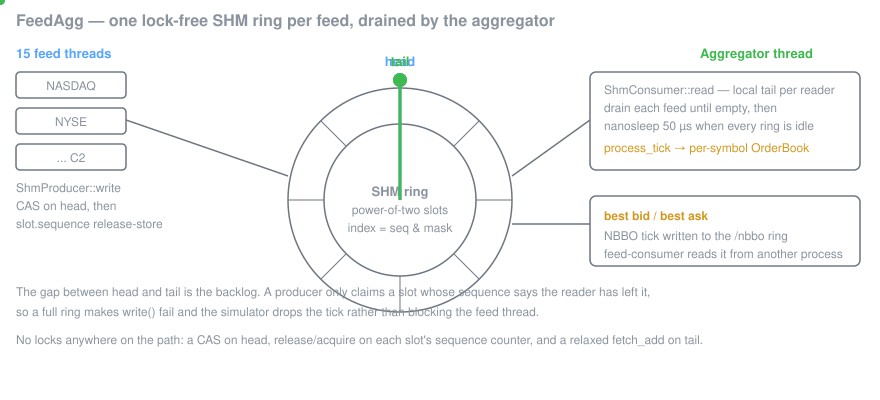
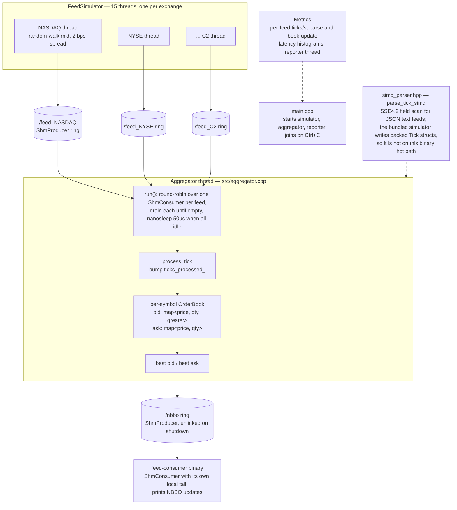

# FeedAgg

A C++17 **market-data aggregator** that consumes from 15 simulated exchange feeds simultaneously.  Uses **SIMD-accelerated JSON parsing** (SSE4.2 / AVX2) and **POSIX shared-memory IPC** to achieve low-latency, high-throughput consolidated order book construction.

---

## Architecture





---

## SIMD JSON Parsing

`parse_tick_simd()` (in `include/feed_agg/simd_parser.hpp`) uses **SSE4.2 PCMPESTRI** to scan 16 bytes at a time for JSON field markers (`"price":`, `"qty":`, `"symbol":`, `"side":`).

- On CPUs with `__SSE4_2__`, field offsets are found via `_mm_cmpestri` with `_SIDD_CMP_EQUAL_ORDERED`.
- When SSE4.2 is unavailable the code falls back to a scalar byte-scan (`scalar_find_str`), so the binary is always correct regardless of CPU.
- **AVX2** path: `-mavx2` enables wider 256-bit memory prefetch, benefiting the surrounding memcpy and `from_chars` double parsing.

Typical improvement over `sscanf` / `strtod`: **3–5× faster** field extraction on a single tick.

---

## Shared Memory IPC Design

Each feed simulator writes `Tick` structs into a **lock-free MPMC ring buffer** laid out in a POSIX shared memory segment (`shm_open` + `mmap`):

```
ShmHeader (64 bytes, cache-line aligned)
  head  : atomic<uint64_t>   — next write slot
  tail  : atomic<uint64_t>   — next read slot
  capacity : uint64_t

ShmSlot[0 … capacity-1]
  sequence : atomic<uint64_t>   — signals slot state (sequence-based MPMC)
  data     : Tick               — payload
```

The sequence-number protocol is identical to `MpmcQueue` in BlitzQueue: a producer CAS-advances `head` and stores `sequence = head + 1`; a consumer CAS-advances `tail` and stores `sequence = tail + capacity` to recycle the slot.  No mutex is needed across process boundaries.

---

## Performance

Target: **aggregate 15,000 ticks/sec** across 15 feeds (1,000 ticks/sec per feed).

Example output (8-core laptop, Release build, AVX2 enabled):

```
────────────────────────────────────────────────
  FeedAgg Metrics Report
────────────────────────────────────────────────
  Feed[ 0]: 998 ticks/sec      (NASDAQ)
  Feed[ 1]: 1001 ticks/sec     (NYSE)
  ...
  Feed[14]: 999 ticks/sec      (C2)
  Total:    14982 ticks/sec

  Parse latency (ns):
    p50: 87
    p95: 142
    p99: 289

  Book update latency (ns):
    p50: 211
    p95: 448
    p99: 912
────────────────────────────────────────────────
```

---

## Prerequisites

| Tool | Version |
|------|---------|
| CMake | >= 3.16 |
| GCC / Clang | GCC 10+ or Clang 12+ |
| Linux kernel | >= 3.x (POSIX shm) |
| CPU | SSE4.2 recommended (AVX2 for best perf) |

### Ubuntu / Debian

```bash
sudo apt-get install -y build-essential cmake
# Optional: spdlog
sudo apt-get install -y libspdlog-dev
```

---

## Build

```bash
git clone https://github.com/nikhil-ghind/FeedAgg.git
cd FeedAgg

cmake -S . -B build -DCMAKE_BUILD_TYPE=Release
cmake --build build --parallel $(nproc)
```

Executables:
- `build/feed-agg`       — main process (simulator + aggregator + metrics)
- `build/feed-consumer`  — standalone SHM NBBO consumer

---

## Run

### All-in-one (simulator + aggregator)

```bash
./build/feed-agg
```

Sample output:

```
╔══════════════════════════════════════╗
║  FeedAgg — Market Data Aggregator    ║
╚══════════════════════════════════════╝

[FeedSimulator] Started 15 exchange feeds
[Aggregator] Started, reading from 15 feeds
Running... Press Ctrl+C to stop.

[Main] Ticks processed: 14843 (~14843/sec)
[Main] Ticks processed: 29701 (~14858/sec)
...
```

### Standalone consumer (reads NBBO from SHM)

```bash
# In terminal 1: start the aggregator
./build/feed-agg

# In terminal 2: attach the consumer
./build/feed-consumer nbbo
```

---

## Test / Smoke Check

There is no separate unit-test target — the system is exercised end-to-end:

```bash
# 1. Build (Release)
cmake -S . -B build -DCMAKE_BUILD_TYPE=Release && cmake --build build --parallel

# 2. Run the all-in-one binary; verify per-feed throughput ~1k ticks/s and
#    aggregated throughput ~15k ticks/s in the metrics report.
./build/feed-agg

# 3. In a second terminal, attach the consumer and verify NBBO updates
#    are visible across process boundaries:
./build/feed-consumer nbbo
```

A run is considered healthy if (a) all 15 feeds report non-zero ticks/s, (b) parse latency p99 stays sub-microsecond on a modern CPU, and (c) the standalone consumer prints NBBO updates while `feed-agg` is running.

---

## Project Layout

```
FeedAgg/
├── include/feed_agg/
│   ├── order_book.hpp       # Thread-safe consolidated order book
│   ├── simd_parser.hpp      # SSE4.2/AVX2 JSON tick parser (header-only)
│   ├── shm_channel.hpp      # POSIX SHM ring buffer producer/consumer
│   ├── aggregator.hpp       # Aggregator interface
│   ├── feed_simulator.hpp   # Feed simulator interface
│   └── metrics.hpp          # Per-feed stats + latency histograms
├── src/
│   ├── main.cpp             # Entry point
│   ├── feed_simulator.cpp   # 15-feed tick generator
│   ├── aggregator.cpp       # Core aggregation loop
│   ├── consumer.cpp         # SHM NBBO consumer example
│   └── metrics.cpp          # Stats reporter
└── CMakeLists.txt
```

---

## License

MIT
